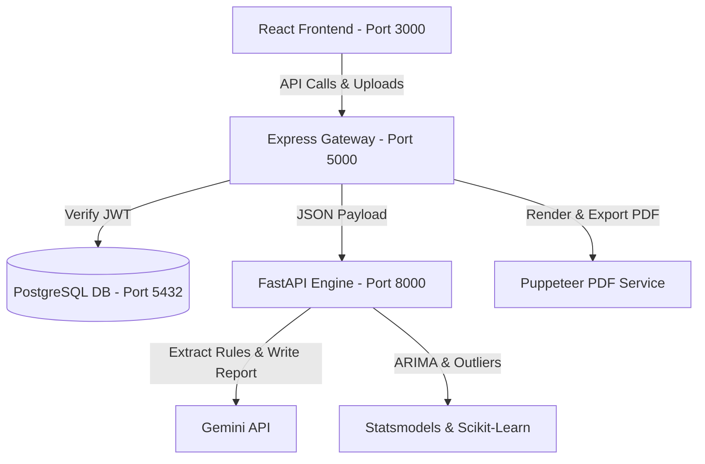

# AI-Powered Organizational Analytics Dashboard

A production-ready full-stack web application designed to run deep statistical audits and strategic growth reports from raw corporate records. The system utilizes a dual Node.js/Express + Python/FastAPI microservice architecture backed by PostgreSQL, running automated time-series forecasting, anomaly detection, feature contribution weights, and Gemini generative audits.

---

## 🛠️ Technology Stack

* **Frontend**: React.js, TypeScript, Tailwind CSS, Recharts, Axios, Lucide Icons, Vite
* **Backend REST API**: Node.js, Express.js, Puppeteer (PDF generator), Multer (file uploader), bcryptjs, JWT Auth
* **Analytics Engine**: Python 3.10, FastAPI, Pandas, NumPy, Scikit-Learn (IsolationForest), Statsmodels (Holt-Winters / ARIMA)
* **Generative AI**: Gemini 1.5 Flash (for requirement extraction and report writing)
* **Database**: PostgreSQL (relational storage with index optimizations)
* **Deployment**: Docker & Docker Compose (deploy-ready)

---

## 🏗️ System Architecture



---

## ⚡ Quick Start (Docker Compose)

The application is fully containerized and configured to run out of the box. Follow these steps to build and boot the stack:

### 1. Configure Environment Variables
Copy `.env.example` to `.env` and fill in your Gemini API Key:
```bash
cp .env.example .env
```
Open `.env` and configure:
```env
GEMINI_API_KEY=AIzaSy...your_gemini_key
JWT_SECRET=some_secure_random_string
```
*(Note: If no Gemini key is specified, the application will automatically fall back to high-quality industry-specific templates, maintaining full out-of-the-box functionality).*

### 2. Run with Docker Compose
Build and run the entire multi-service stack:
```bash
docker-compose up --build
```
This command builds the images, initializes the PostgreSQL database, applies schema tables, mounts directories, and launches the web app.

### 3. Open the Web Application
Once the containers are running:
* **Frontend Dashboard**: Open [http://localhost:3000](http://localhost:3000)
* **Backend Gateway URL**: [http://localhost:5000](http://localhost:5000)
* **FastAPI Docs Check**: [http://localhost:8000/docs](http://localhost:8000/docs)

---

## 📊 Sample User Flow & Demo Data

To run a diagnostic audit out of the box without preparing a custom file:
1. Open the app at [http://localhost:3000](http://localhost:3000) and **Create Account**.
2. Click **New Analysis**.
3. Answer the chatbot questions (Org Name, Industry, Sizing, Strategic concerns).
4. On the final step, click **"Use Demo Dataset"**. This automatically links the backend to our pre-configured `database/sample_data.csv` containing a 12-month departmental ledger.
5. Click **Generate Dashboard**. The screen displays animated progress trackers as calculations complete.
6. Interact with the Recharts dashboards (tab between Trend Forecasting, Department comparisons, and Allocation donuts), check isolated anomalies, and read the SWOT markdown blocks.
7. Click **"Download PDF Report"** to download a styled multi-page PDF compiled on the server.

---

## 📡 REST API Specifications

### Authentication
* `POST /api/auth/register` - Create user credentials
* `POST /api/auth/login` - Sign in and return JWT token

### Data Upload
* `POST /api/upload/data` - Multipart upload for CSV/Excel datasets. Saves files to `/uploads` directory and returns path.

### Analysis & Reports
* `POST /api/analyze` - Orchestrates organizational diagnostics. Saves records to `reports` and `recommendations` tables.
* `GET /api/reports/:id` - Fetch details of a specific report.
* `GET /api/reports/user/:userId` - List summary records of past audits for history listing.
* `POST /api/reports/:id/export` - Run Puppeteer to print the audit report to a high-fidelity PDF, returning file download stream.
* `DELETE /api/reports/:id` - Delete report and cascaded references.
